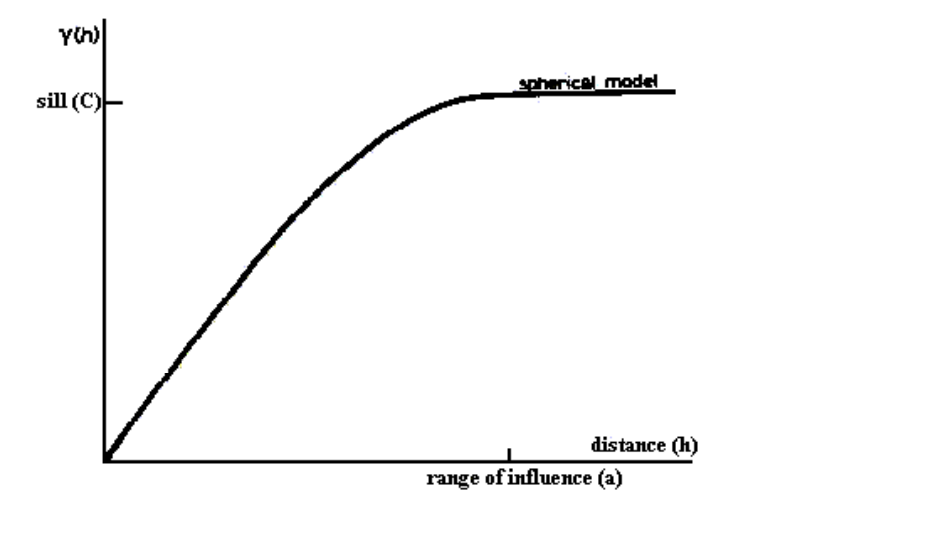

```{r}
library(sp)
library(gstat)
data(meuse)
```


```{r}
coordinates(meuse) <- c("x", "y")
plot(meuse, asp=1, pch=1)
data(meuse.riv)
lines(meuse.riv)
```

```{r}
plot(meuse, asp = 1, cex = 4*meuse$zinc/max(meuse$zinc), pch = 1)
lines(meuse.riv)
```

Banyaknya pasangan titik

```{r}
meuse$logZn <- log10(meuse$zinc)
n <- length(meuse$logZn)
n * (n - 1)/2
```

Menghitung jarak antar titik

```{r}
coordinates(meuse)[1, ]
coordinates(meuse)[2, ]
sep <- dist(coordinates(meuse)[1:2, ])
sep
```

Hitung semivarians $\gamma(x_1, x_j) = \frac{1}{2}[z(x_i)-z(x_j)]^2$

```{r}
gamma <- 0.5 * (meuse$logZn[1] - meuse$logZn[2])^2
gamma
```

Plot variogram dari konsentrasi log-Zn

```{r}
v <- variogram(logZn ~ 1, meuse, cutoff = 1300, width = 90)
v
plot(v, plot.numbers=T)
```

Pada pendugaan pasangan titik dengan jarak 72.248 nilai semivariance sekitar 0.0264 dan seterusnya. Semakin besar jarak suatu pasangan titik nilai semivarians semakin besar kemudian pada pasangan titik tertentu pada jarak 800an nilainya konvergen. 

Tren pada penurunan semivarians dengan penurunan jarak pisahnya yang tampak memotong sumbu y (yaitu, pada jarak pemisahan 0) sekitar 0.01 log(mg kg-1)2. Inilah yang disebut nugget




- Nilai semivarians pada jarak d=0 adalah 0 karena tidak ada perbedaan titik pada dirinya sendiri
- Semakin jauh jarak suatu titik maka nilai semivarians pun meningkat

```{r}
show.vgms()
```

Jenis pola variogram:

- Nugget artinya konstan
- Exponential
- Gaussian
- Yang paling umum Spherical
- dll

Fit model dengan variogram spherical, untuk melihat seberapa sesuai model tersebut dengan keragaman data yang ada

```{r}
vm <- vgm(psill = 0.12, model = "Sph", range = 850, nugget = 0.01)
vm
plot(v, pl = T, model = vm)
```

Secara umum, dapat dilihat bahwa pola spherical mengikuti sebaran data namun tidak persis sama sehingga dilakukan penyesuaian pada model dengan data empirik menggunakan fungsi gstat automatic fit `fit.variogram`

```{r}
vmfit <- fit.variogram(v, vm)
vmfit
plot(v, pl = T, model = vmfit)
```

Terlihat bahwa beberapa pola titik tersebut sudah mengikuti dengan model variogramnya 


## Ordinary Kriging


```{r}
data(meuse.grid)
coordinates(mg) <- c("x", "y")
gridded(meuse.grid) <- T
```

Prediksi nilai atribut pada semua grid menggunakan Ordinary Kriging

```{r}
k40 <- krige(logZn ~ 1, locations = meuse, newdata = meuse.grid, model = vmfit)
```

```{r}
str(k40)
```

`var1.pred` adalah nilai prediksi dari hasil interpolasi yang telah dibuat

```{r}
spplot(k40, "var1.pred", asp=1, main="OK prediction, log-ppm Zn")
```

Dapat dilihat titik-titik atau tanah atau landscape yang berada di sekitar sungai meuse memiliki kandungan zinc lebih tinggi

Berikut ini ada plot varians dari hasil prediksi

```{r}
spplot(k40, "var1.var", col.regions=cm.colors(64), asp=1, main="OK prediction variance, log-ppm Zn^2")
```

```{r}
pts.s <- list("sp.points", meuse, col="white", pch=1, cex=4*meuse$zinc/max(meuse$zinc))
pts.s
spplot(k40, "var1.pred", asp=1, col.regions=bpy.colors(64), main="OK prediction, log-ppm Zn", sp.layout = list(pts.s))
```

```{r}
pts.s <- list("sp.points", meuse, col="black", pch=20)
spplot(k40, zcol="var1.var", col.regions=cm.colors(64), asp=1, main="OK prediction variance, log-ppm Zn^2",sp.layout = list(pts.s))
```

Terlihat bahwa wilayah yang memiliki ragam paling tinggi adalah wilayah yang sedikit sekali dijumpai kehadiran titik atau tanah. Kesimpulannya adalah tingginya kandungan zinc tidak dipengaruhi oleh tingginya ragam tetapi oleh banyaknya sebaran titik pengamatan di wilayah tersebut. 

### Evaluasi model

```{r}
zn.okcv <- krige.cv(log(zinc)~1, meuse, meuse.grid, model = vmfit)
zn.okcv
RMSE.ok <- sqrt(sum(zn.okcv$residual^2)/length(zn.okcv$residual))
RMSE.ok
```

## Co-Kriging

Mirip kriging hanya menyertakan covariate

```{r}
meuse.lst <- list(Polygons(list(Polygon(meuse.riv)), "meuse.riv"))
meuse.sr <- SpatialPolygons(meuse.lst)
image(meuse.grid["dist"]) # one of the variables in meuse.grid
plot(meuse.sr, add=TRUE)
title("distance to river")
```

```{r}
zn.lm <- lm(log10(zinc) ~ sqrt(dist), meuse)
meuse$fitted.s <- predict(zn.lm,meuse)
-mean(predict(zn.lm,meuse))
```

```{r}
meuse$residuals <- residuals(zn.lm)
spplot(meuse,c("fitted.s","residuals"))
```

Membangkitkan permukaan krieg baru dengan covariat

```{r}
vm.ck <- variogram(log10(zinc) ~ sqrt(dist), meuse)
vm.ck
plot(vm.ck, plot.numbers = TRUE, pch = "+")
```

```{r}
m.ck <- fit.variogram(vm.ck, vgm(.03, "Sph", 800, .015))
m.ck
plot(vm.ck, model=m.ck)
```

```{r}
ko.ck <- krige(log(zinc)~ sqrt(dist), meuse, meuse.grid, model=m.ck)
ko.ck
```

```{r}
pts <- list("sp.points", meuse,pch=3, col="black")
meuse.layout <- list(pts)
spplot(ko.ck["var1.pred"], sp.layout=meuse.layout, main="cokriging predictions-Zn/distance river ")
```

```{r}
ko.ck$cek <- sqrt(ko.ck$var1.var)
spplot(ko.ck, zcol='cek', sp.layout=meuse.layout, main="cokriging se-Zn(covariate)")
```
```{r}
summary(ko.ck)
```

Evaluasi


```{r}
zn.ckcv <- krige.cv(log(zinc)~ sqrt(dist), meuse,meuse.grid,model=m.ck)
RMSE.ck <- sqrt(sum(zn.ckcv$residual^2)/length(zn.ckcv$residual))
RMSE.ck
```

Kesimpulan: saat jaraknya besar maka kadungan zinc sedikit

Back Transform

```{r}
ko.ck$predt <- 10^(ko.ck$var1.pred)
spplot(ko.ck["predt"], sp.layout=meuse.layout, main = "Co-Kriging predictions-Meuse zinc log/backtrans(Zn)")
```

